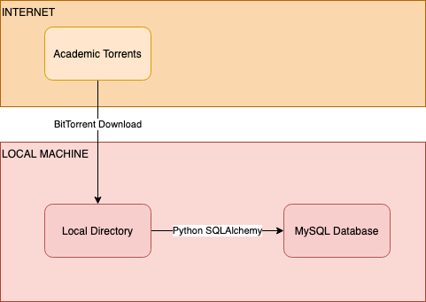

# 2 - Local Pipeline with BitTorrent and MySQL

## 2.1 - Purpose of the Local Pipeline
The purpose of this pipeline was to get an end-to-end process from the MSD subset to a local database, which in my case was MySQL. It also
helped in figuring out:
1. What the final Entity Relationship Diagram (ERD) of the database would be
2. How to use the Python package SQLAlchemy to connect to a database and create/populate the database

## 2.2 - Database Design
Here is the final ERD that resulted for the destination database (built with [draw.io](https://app.diagrams.net/)):

## 2.3 - Pipeline Design
Here is a simple diagram of the local pipeline dataflow (built with [Visual Paradigm Online](https://online.visual-paradigm.com/login.jsp?t=diagrams)):

## 2.4 - Code
* code/download_torrent_on_mac.py - this module can be used to download a torrent via BitTorrent technology
* code/migrate_to_mysql.py - this module can be used to clean the million song dataset and migrate to a local MySQL server
* code/master.py - this file can be used to run the above 2 in order to complete the download and migration in one run

## 2.5 - How to reproduce this pipeline
* on your local machine, download the 3 Python scripts
* verify you have a local installation of MySQL
* update the code files with your MySQL credentials
* run the master.py file

## 2.6 - Runtime estimates
* download_torrent_on_mac.py - this portion takes on average 45 minutes, though can fluctuate a lot
* migrate_to_mysql.py - this portion takes around 35 minutes
