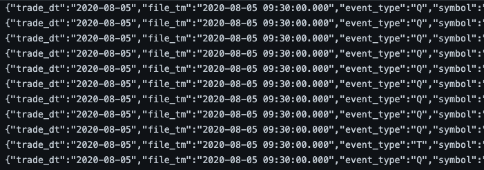
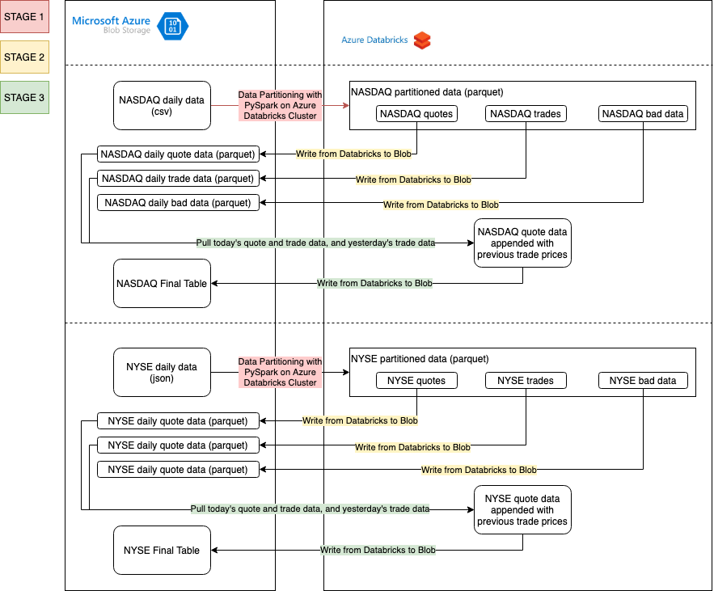

# 1 - Background

## 1.1 - Objective
The second capstone in Springboard's Data Engineering bootcamp was a "guided" capstone. The problem statement was provided and the following technologies were used: Azure Blob Storage, Azure Databricks, PySpark DataFrames & SQL, Parquet files.

## 1.2 - Topic
This project involves an ETL that takes NASDAQ and NYSE data from Azure Blob Storage, transforms them in Azure Databricks, then writes the final output back to Blob Storage. The data are stock price transactions, most of which are quoted prices and some of which are actual traded prices. The purpose of the ETL is to transform the data in a way that results in just the quotes, with the most recent trades and yesterday's closing trade as extra columns. The following sections will make this more clear.

## 1.3 - Datasets
All input data can be found in [data](https://github.com/Derek-Funk/springboard-derek-funk/tree/master/capstone-2-adb-etl/data), which I also have in Azure Blob Storage. These are the initial data that our ETL will process from.

There is a separate folder for each stock exchange, and within 2 separate date folders (20200805, 20200806). At the child level, you can examine what each of the data files looks like. For NYSE, note that they are text files with comma-separated values while NASDAQ has a json format. Though they are formatted differently, they contain the same type of data.

NYSE example:

NASDAQ example:

# 2 - ETL

## 2.1 - ETL Architecture
The following diagram is a visual for the ETL. We will go through each of the stages.

## 2.2 - ETL Stage 1
The code for Stage 1 is contained in the Azure Databricks notebook [guidedcapstonestep2_accesskeyhidden.ipynb](code/guidedcapstonestep2_accesskeyhidden.ipynb).

This notebook is a PySpark script which I've hosted on an Azure Databricks cluster and does the following:
* creates a file mount so that the cluster has access to the Blob Storage
* partitions the NASDAQ and NYSE data into quotes and trades (and bad data, if there are any)
* structure the partitions into dataframes with well-defined schemas
* write the partitions on the cluster as parquet files

# How to reproduce
